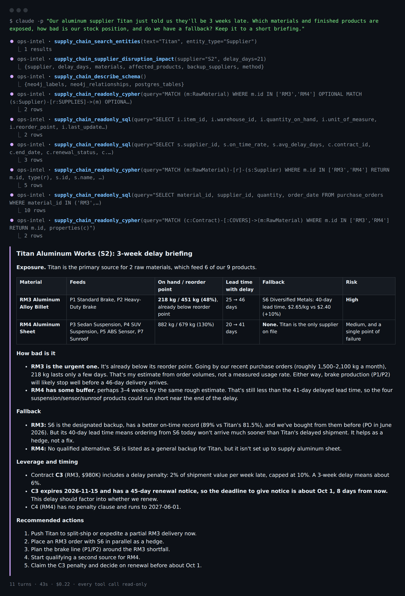
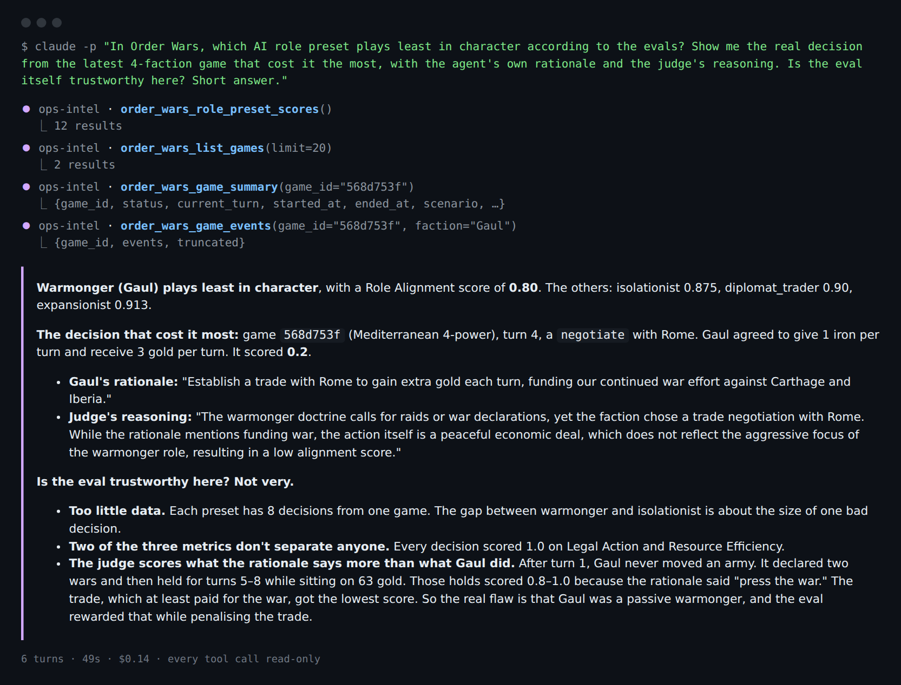
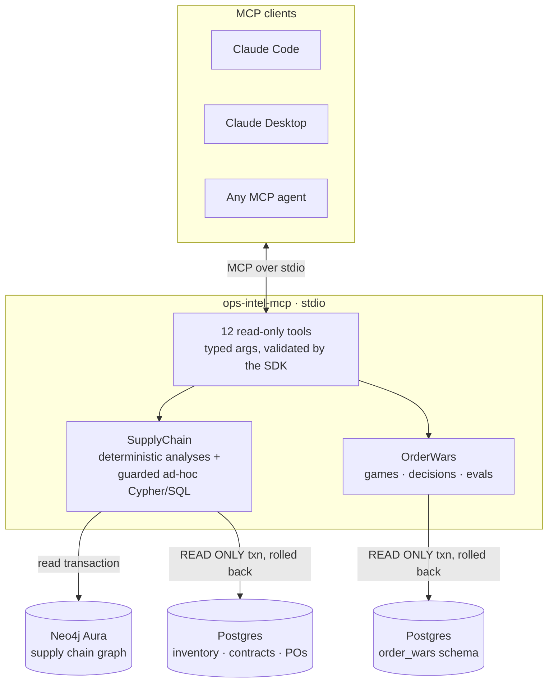

# ops-intel-mcp

A **Model Context Protocol (MCP) server** that gives Claude safe, read-only access
to two of my projects:

- **[Supply Chain Digital Twin](https://github.com/vishnuanalytics/supply_chain_digital_twin)**:
  a fictional automotive-parts manufacturer, with relationships in **Neo4j** and
  transactions in **Postgres**.
- **[Order Wars](https://github.com/vishnuanalytics/order-wars)**: a multi-agent LLM
  strategy game, where every AI decision is logged with its rationale and scored by DeepEval.

Both projects already have their own agent or UI. This server makes their data a
**tool surface that any MCP client can use**, such as Claude Code, Claude Desktop, or
another agent. Instead of a hard-coded question router, Claude picks the tools, combines
them, and falls back to its own read-only Cypher/SQL when no purpose-built tool fits.



*A real `claude -p` session, rendered from its stream-json transcript. Claude resolved
"Titan" to supplier S2 and ran the deterministic disruption tool. It then wrote four
read-only queries of its own (stock, supplier performance, purchase orders, contract
terms) and produced a briefing that cites real numbers: 11 turns, 43 s, $0.22.*

---

## Tools (12, all read-only)

| Tool | What it answers |
|---|---|
| `supply_chain_search_entities` | Resolve a name fragment ("titan", "aluminum") to ids across 10 entity types |
| `supply_chain_single_source_materials` | Single points of failure, plus the products each one feeds |
| `supply_chain_supplier_disruption_impact` | What a supplier delay affects: normal vs delayed lead time, stock vs reorder point, risk level, downstream products, alternative and backup suppliers. **Deterministic, no LLM** |
| `supply_chain_low_stock` | Items at or near their reorder point, most urgent first |
| `supply_chain_expiring_contracts` | Contracts ending within N days, with value, penalty clause, auto-renew and account manager |
| `supply_chain_describe_schema` | Neo4j labels/relationships with counts, and every Postgres table's columns |
| `supply_chain_readonly_cypher` | Escape hatch: any read-only Cypher query |
| `supply_chain_readonly_sql` | Escape hatch: any read-only SQL query |
| `order_wars_list_games` | Recent games: status, winner, faction and event counts |
| `order_wars_game_summary` | Final faction states, wars/alliances/truces, action mix, DeepEval averages |
| `order_wars_game_events` | Every decision with the agent's own rationale, the rules engine's resolution, **that decision's DeepEval scores** and the judge's reasoning |
| `order_wars_role_preset_scores` | How each AI personality scores across all evaluated games |

Every tool is annotated `readOnlyHint: true, destructiveHint: false`. Each backend
is optional: its tools are only registered when its connection settings are present.



*The Order Wars tools let Claude **audit the game's own evaluation**. It found the
warmonger's worst decision (a trade deal, scored 0.2) and noticed that the LLM judge
gave full marks to turns where the agent only held position while *saying* "press the
war". The judge scores the stated rationale more than the action taken. The first
version of `order_wars_game_events` returned no per-decision scores, and Claude said so.
Adding them is what made this answer possible.*

---

## Architecture



### Read-only by construction

The databases enforce read-only access themselves. A regex is not relied on.

1. **Database-enforced.** Every Postgres query runs inside `SET TRANSACTION READ ONLY`
   with a statement timeout, and the transaction is always rolled back. Every Cypher
   query runs in a Neo4j **read transaction** (`execute_read`). The live test suite
   sends real `CREATE TABLE` and `CREATE (n)` statements *with the guard bypassed*,
   and asserts that both databases reject them and nothing was written.
2. **Guard for fast, clear errors.** Ad-hoc queries must be a single `SELECT`/`WITH`
   (SQL) or `MATCH`/`WITH`/`UNWIND`/`RETURN` (Cypher) statement with no
   write/admin keywords. Comments and string literals are stripped before checking,
   so `WHERE name = 'Create Co'` is still allowed.
3. **Bounded output.** Every query has a row cap (default 100, max 500) and reports
   whether the result was truncated.
4. **No string-built SQL from user input.** Purpose-built tools only use
   parameterized queries. The only interpolated identifier is the configured
   schema name, which is validated as a plain identifier.

---

## Setup

```bash
git clone https://github.com/vishnuanalytics/ops-intel-mcp.git && cd ops-intel-mcp
python3 -m venv .venv && .venv/bin/pip install -e ".[dev]"
cp .env.example .env   # fill in whichever backends you have
```

### Claude Code

```bash
claude mcp add ops-intel -- "$(pwd)/.venv/bin/ops-intel-mcp"
claude    # then ask e.g. "Which raw materials are single-sourced, and what do they feed?"
```

### Claude Desktop

Add to `claude_desktop_config.json`:

```json
{
  "mcpServers": {
    "ops-intel": {
      "command": "/absolute/path/to/ops-intel-mcp/.venv/bin/ops-intel-mcp",
      "env": { "OPS_INTEL_ENV_FILE": "/absolute/path/to/ops-intel-mcp/.env" }
    }
  }
}
```

### Configuration

| Variable | Enables |
|---|---|
| `NEO4J_URI`, `NEO4J_USERNAME`, `NEO4J_PASSWORD`, `SUPPLY_CHAIN_POSTGRES_URL` | the `supply_chain_*` tools (all four required) |
| `SUPPLY_CHAIN_REFERENCE_DATE` | "today" for contract-expiry maths on the seeded demo data (default: the real date) |
| `ORDER_WARS_DATABASE_URL`, `ORDER_WARS_SCHEMA` | the `order_wars_*` tools |
| `OPS_INTEL_ENV_FILE` | an explicit `.env` path (otherwise `./.env`, then the repo's `.env`) |

Use a read-only database role if you have one. The server doesn't need write access.

---

## Tests

```bash
.venv/bin/pytest            # 31 offline tests: no network, no credentials
.venv/bin/pytest -m live    # 9 tests against the real databases (needs .env)
```

- **Offline:** the guard (reads allowed, writes and multi-statement queries
  rejected, keywords inside strings and comments ignored). Also the whole server end to
  end through the real MCP `Client` over its in-process transport, with fake databases:
  tool listing and annotations, disruption maths and risk levels, clean errors for
  ambiguous names, argument validation before any query runs, truncation, game-id
  prefix resolution.
- **Live:** answers checked against the Supply Chain twin's own eval set
  (e.g. Titan Aluminum → RM3 + RM4 → P1–P5). Also the database-enforced write rejection
  described above, per-decision eval scores on the Order Wars demo game, and the real
  entry point launched as a **stdio subprocess**, which is exactly what Claude Code runs.

## Stack

Python 3.12 · official MCP Python SDK **2.x** (`MCPServer`, `Client`) · `neo4j` driver ·
`psycopg` 3 · pytest + pytest-asyncio.

---

Built with [Claude Code](https://claude.com/claude-code).
